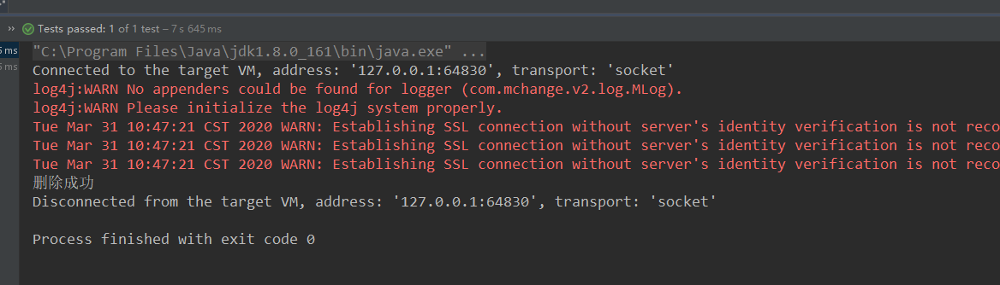
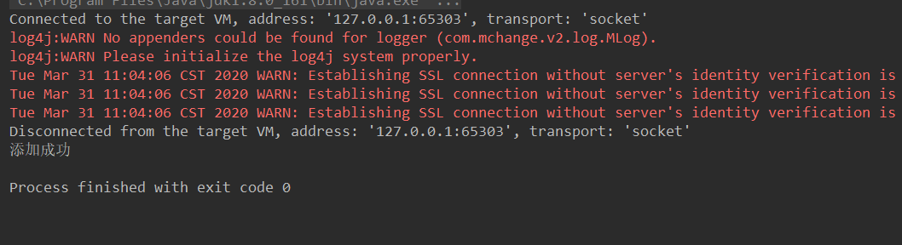
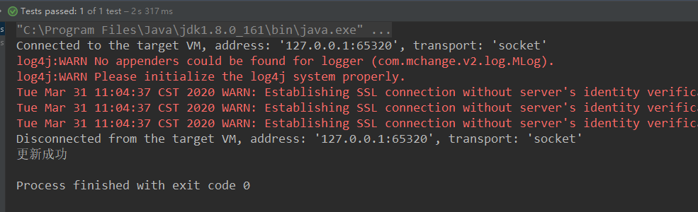

## **一、简单题**

### 1、Mybatis动态sql是做什么的？都有哪些动态sql？简述一下动态sql的执行原理？

答：动态sql是mybatis的一个最大特性，他支持一些条件、多参等对sql语句进行编辑，并且可以实现一些复杂的业务。

动态sql是实现在它的多样的标签上的，例如if、where、foreach、when、otherwise等等。

它的实现原理就是将这种动态标签转换成对应的语句进行拼接，使用mybatis内部的方法将配置文件中的各种标签进行解析，利用XMLMapperBuilder、XMLStatementBuilder将对应的sql语句转换成BoundSql对象，将sql和参数装配进去，最后执行数据库操作。

### 2、Mybatis是否支持延迟加载？如果支持，它的实现原理是什么？

答：mybatis支持延时加载。

延迟加载是在进行关联查询的时候进行的。主要原理是使用动态代理来实现的，使用代理是会执行一些额外操作通过SqlSession去执行嵌套的SQL。只有在使用到某些对象的属性，通过拦截器看到所需要的对象为空，就会去数据库执行能拿到对象的语句。

### 3、Mybatis都有哪些Executor执行器？它们之间的区别是什么？

答：有三种执行器，也就是有三种实现。

一般使用SimpleExecutor，他每一次select或者update都会新准备一个Statement对象（调用prepareStatement()方法），每次用完后都会再将其关闭（调用closeStatement()方法）。

```java
private Statement prepareStatement(StatementHandler handler, Log statementLog) throws SQLException {
  Statement stmt;
  Connection connection = getConnection(statementLog);
  stmt = handler.prepare(connection, transaction.getTimeout());
  handler.parameterize(stmt);
  return stmt;
}
```

第二种是ReuseExecutor，他准备Statement对象时是使用已经有的sql语句来进行查找，如果不存在这个Statement就创建，并且用完之后不关闭这个对象。

```java
private Statement prepareStatement(StatementHandler handler, Log statementLog) throws SQLException {
  Statement stmt;
  BoundSql boundSql = handler.getBoundSql();
  String sql = boundSql.getSql();
  if (hasStatementFor(sql)) {
    stmt = getStatement(sql);
    applyTransactionTimeout(stmt);
  } else {
    Connection connection = getConnection(statementLog);
    stmt = handler.prepare(connection, transaction.getTimeout());
    putStatement(sql, stmt);
  }
  handler.parameterize(stmt);
  return stmt;
}
```

第三种是BatchExecutor，它属于一种批处理操作，它将用到的sql放到一块来先add，准备好后执行executeBatch，

```java
...
batchResultList.add(new BatchResult(ms, sql, parameterObject));
..
handler.batch(stmt);
```

### 4、简述下Mybatis的一级、二级缓存（分别从存储结构、范围、失效场景。三个方面来作答）？

答：一级缓存存储结构PerpetualCache它内部就是一个Map类型的cache，values存储着查询出的缓存数据，他是在一个sqlSession中的范围。如果调用了sqlSession的close()、或者在执行了update、delete、insert、操作之后都会失效。

二级缓存是mapper级别的缓存，默认存储在内存中，或者我们可以使用第三方的缓存例如redis来实现。只用在sqlsession执行了close方法才会将数据存放到缓存里面。同样在执行了update、delete、insert、操作之后都会失效。

### 5、简述Mybatis的插件运行原理，以及如何编写一个插件？

答：mybatis的插件实质上都是interceptor拦截器，都是实现了这个接口来实现的，内部原理使用了动态代理，将所要执行的操作进行包装。

自定义一个插件只需要实现interceptor接口，重写里面的三个抽象方法就可以实现。

## **二、编程题**

### 请完善自定义持久层框架IPersistence，在现有代码基础上添加、修改及删除功能。【需要采用getMapper方式】

增加三个功能一次需要作出如下改变，首先在IUserMapper中加入三个方法updateOne、insertOne、deleteOne

```java
public interface IUserDao {

    List<User> findAll();

    User findOneByCondition(User user);

    int updateOne(User user);

    int insertOne(User user);

    int deleteOne(int id);

}
```

接下来在配置文件中添加语句

```xml
<update id="updateOne" paramterType="com.lxr.pojo.User">
    update user set username = #{username} where id = #{id}
</update>
<insert id="insertOne" paramterType="com.lxr.pojo.User">
    insert into user values(#{id},#{username})
</insert>
<delete id="deleteOne" paramterType="java.lang.Integer">
    delete from user where id=#{id}
</delete>
```

接下来加入xml对三个标签的解析

```java
public void parse(InputStream inputStream) throws DocumentException {
...
    List<Element> updateNodes = new ArrayList<>();
    updateNodes.addAll(rootElement.selectNodes("//update"));
    updateNodes.addAll(rootElement.selectNodes("//delete"));
    updateNodes.addAll(rootElement.selectNodes("//insert"));

    for (Element node : updateNodes) {
        String id = node.attributeValue("id");
        String paramterType = node.attributeValue("paramterType");
        String sql = node.getTextTrim();
        MappedStatement statement = new MappedStatement();
        statement.setId(id);
        statement.setParamterType(paramterType);
        statement.setSql(sql);
        String key = namespace+"."+id;
        configuration.getMappedStatementMap().put(key,statement);
    }
}
```

然后在SqlSession以及对应的实现类中加入updateOne方法（因为insert、updata、delete最后均调用updata所以只需要添加一个update即可），在getMapper中加入integer的判断，再在Executor接口及对应实现类中加入update方法

```java
public interface SqlSession {
    ...
    public <T> T getMapper(Class<?> mapperClass);
    public int updateOne(String statementId,Object... param) throws Exception;
}
```

```java
public class DefaultSqlSession implements  SqlSession{
    private Configuration configuration;
    DefaultSqlSession(Configuration configuration){
        this.configuration = configuration;
    }
    ...
    @Override
    public int updateOne(String statementId, Object... param) throws Exception {
        SimpleExecutor simpleExecutor = new SimpleExecutor();
        int result = simpleExecutor.update(configuration, configuration.getMappedStatementMap().get(statementId), param);
        return result;
    }
    @Override
    public <T> T getMapper(Class<?> mapperClass) {
        Object instance = Proxy.newProxyInstance(this.getClass().getClassLoader(), new Class[]{mapperClass},
                (proxy,method,args)-> {
                String methodName = method.getName();
                String className = method.getDeclaringClass().getName();
                String statementId = className+"."+methodName;

                Type genericReturnType = method.getGenericReturnType();
                if(genericReturnType instanceof ParameterizedType)
                    return selectList(statementId,args);
                else if(genericReturnType ==Integer.TYPE)
                    return updateOne(statementId,args);

                return selectList(statementId,args);

        });
        return (T) instance;
    }
}
```

```java
public interface Executor {
...
    int update(Configuration configuration,MappedStatement ms, Object... params) throws Exception;
}
```

```java
public class SimpleExecutor implements Executor{
    private PreparedStatement preparedStatement;
    private void initPreparedStatement(Configuration configuration, MappedStatement mappedStatement, Object... params) throws Exception {
//      1、注册驱动，获取链接
        Connection connection = configuration.getDataSource().getConnection();
        String sql = mappedStatement.getSql();
        //2、获取sql语句
        BoundSql boundSql = getBoundSql(sql);
        //3、预处理对象
        preparedStatement = connection.prepareStatement(boundSql.getSql());
        //4、设置参数
        String paramterType = mappedStatement.getParamterType();
        Class<?> clazz = getClassType(paramterType);
        List<ParameterMapping> parameterMappings = boundSql.getParameterMappings();
        for (int i = 0; i < parameterMappings.size(); i++) {
            ParameterMapping parameterMapping = parameterMappings.get(i);
            String content = parameterMapping.getContent();
            if(clazz==Integer.class){
                preparedStatement.setObject(i + 1, params[0]);
            }else{
                Field declaredField= clazz.getDeclaredField(content);
                declaredField.setAccessible(true);
                Object o = declaredField.get(params[0]);
                preparedStatement.setObject(i + 1, o);
            }
        }
    }

    @Override
    public int update(Configuration configuration, MappedStatement ms, Object... params) throws Exception {
        initPreparedStatement(configuration,ms,params);
        int i = preparedStatement.executeUpdate();
        return i;
    }
}
```

这里需要注意在准备preparedStatement这个对象时因为查询传入为User，而删除传入的是Integer所以要对参数做一下小判断。

最后准备测试类

```java
@Test
public void testUpdate() {
    User user = new User();
    user.setId(1);
    user.setUsername("lxr");
    int i = userDao.updateOne(user);
    System.out.println(i>0?"更新成功":"更新失败");
}
@Test
public void testDelete() {
    int i = userDao.deleteOne(1);
    System.out.println(i>0?"删除成功":"删除失败");
}
@Test
public void testInsert() {
    User user = new User();
    user.setId(10);
    user.setUsername("insertLxr");
    int i = userDao.insertOne(user);
    System.out.println(i>0?"添加成功":"添加失败");
}
```

最后效果





