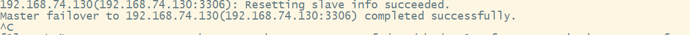

搭建步骤：

4个服务器

主：001

从：002、003

mha：localhost

搭建步骤：

1、搭建001，002，003 的3台数据库mysql 以及manage node 安装

2、配置主从以及开启binlog和复制相关配置

3、搭建manager到第四台服务器上

4、启动1，2，3并把2，3指定到1为主库

视频1：展示主从复制以及半同步复制的效果

视频2：展示mha自动切换主库的效果

