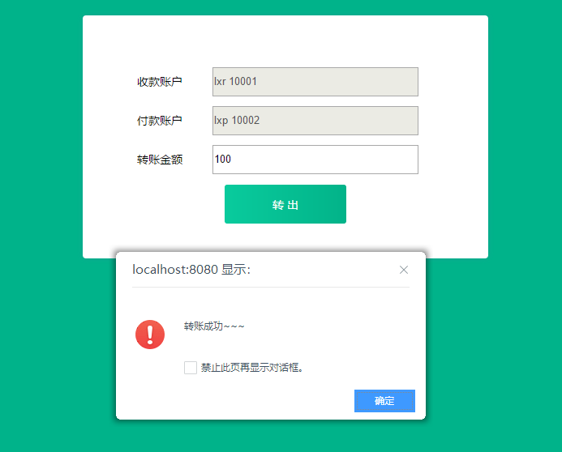
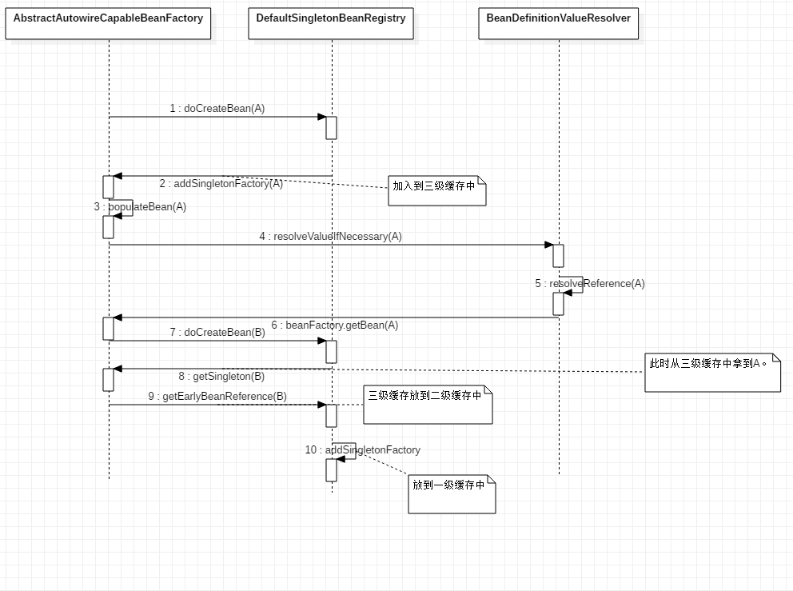

1、学员自定义@Service、@Autowired、@Transactional注解类，完成基于注解的IOC容器（Bean对象创建及依赖注入维护）和声明式事务控制，写到转账工程中，并且可以实现转账成功和转账异常时事务回滚

答：首先自定义几个注解

```java
@Target(ElementType.FIELD)
@Retention(RetentionPolicy.RUNTIME)
@Documented
public @interface MyAutowire {
}
```

```java
@Target(ElementType.TYPE)
@Retention(RetentionPolicy.RUNTIME)
@Documented
public @interface MyComponent {
	String value() default "";
}
```

```java
@Target(ElementType.TYPE)
@Retention(RetentionPolicy.RUNTIME)
@Documented
public @interface MyService {
    String value() default "";
}
```

```java
@Target(ElementType.METHOD)
@Retention(RetentionPolicy.RUNTIME)
@Documented
public @interface MyTransactional {

}
```

接下来在BeanFactory进行解析，分别对这几个注解进行对应的处理

```java
private static Map<String,Object> map = new HashMap<>();  // 存储对象
public static void init(){
    Reflections f = new Reflections("com.lagou.edu");
    Set<Class<?>> myServiceSet = f.getTypesAnnotatedWith(MyService.class);
    Set<Class<?>> myComponentSet = f.getTypesAnnotatedWith(MyComponent.class);
    myServiceSet.addAll(myComponentSet);
    for (Class<?> c : myServiceSet) {
        try {
            //实例化
            if(c.isInterface()){
                continue;
            }
            Object bean = c.newInstance();
            Type[] genericSuperclass = c.getGenericInterfaces();
            if(genericSuperclass!=null&&genericSuperclass.length>0){
                for (int i = 0; i < genericSuperclass.length; i++) {
                    map.put(genericSuperclass[i].getTypeName(), bean);
                }
            }else{
                map.put(c.getName(), bean);
            }
        } catch (Exception e) {
            e.printStackTrace();
        }
    }

    for(Map.Entry<String,Object> beanEntry:map.entrySet()){
        Object bean = beanEntry.getValue();
        //Transaction改装
        Class<?> clazz = bean.getClass();
        Method[] declaredMethods = clazz.getDeclaredMethods();
        if(declaredMethods!=null&&declaredMethods.length>0){
            for (Method method:declaredMethods){
                Annotation[] declaredAnnotations = method.getDeclaredAnnotations();
                if(declaredAnnotations!=null&&declaredAnnotations.length>0){
                    for(Annotation anno:declaredAnnotations){
                        if(anno instanceof MyTransactional){
                            ProxyFactory proxyFactory = (ProxyFactory)getBean("com.lagou.edu.factory.ProxyFactory");
                            map.put(beanEntry.getKey(),proxyFactory.getJdkProxy(bean));
                        }
                    }
                }
            }
        }
        //field装配
        Field[] declaredFields = clazz.getDeclaredFields();
        for (Field field:declaredFields){
            Annotation[] declaredAnnotations = field.getDeclaredAnnotations();
            if(declaredAnnotations !=null){
                for (Annotation annotation:declaredAnnotations){
                    if(annotation instanceof MyAutowire){
                        String name = field.getType().getName();
                        Object o = map.get(name);
                        try {
                            String methodName = "set" + field.getType().getSimpleName();
                            Method[] method = declaredMethods;
                            for (Method method1 : method) {
                                if(method1.getName().equals(methodName)){
                                    method1.setAccessible(true);
                                    method1.invoke(bean,o);
                                }
                            }
                        } catch (IllegalAccessException e) {
                            e.printStackTrace();
                        } catch (InvocationTargetException e) {
                            e.printStackTrace();
                        }
                    }
                }
            }
        }
    }
}
```

然后在用到的类中分别使用这几个注解（这里不粘贴代码，很多类）

接下来进行一次update操作



这里使用了MyTransactional注解和动态代理实现了对事物的控制

```java
@Override
@MyTransactional
public void transfer(String fromCardNo, String toCardNo, int money) throws Exception {
    
        Account from = accountDao.queryAccountByCardNo(fromCardNo);
        Account to = accountDao.queryAccountByCardNo(toCardNo);

        from.setBalance(from.getBalance()-money);
        to.setBalance(to.getBalance()+money);
        accountDao.updateAccountByCardNo(to);
        accountDao.updateAccountByCardNo(from);
        
}
```

其余的变量需要注入的使用@MyAutowire,需要放到容器中的使用@MyService和@MyComponent

具体代码在lagou-transfer中

2、根据源码剖析，记录spring循环依赖处理机制中的调用关系，画出uml时序图

